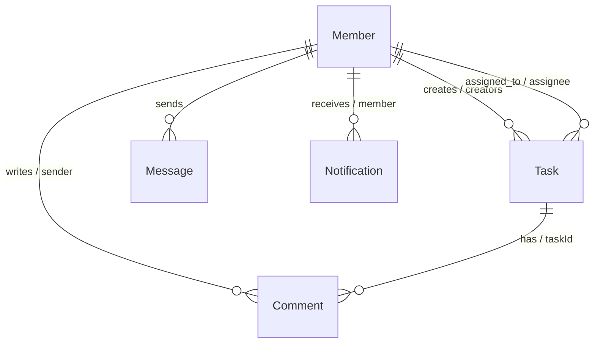

# تطبيق مهمتي (Mohemmaty) - توثيق النظام الشامل

تطبيق **مهمتي** هو نظام متكامل لإدارة المهام والتواصل اللحظي مخصص للفرق والشركات الصغيرة (حتى 20 مستخدماً). يتميز التطبيق بواجهة مستخدم عصرية تحاكي تطبيقات الهواتف المحمولة الذكية (Mobile-First) داخل غلاف أنيق، ويدعم وضع التشغيل غير المتصل بالإنترنت (PWA) مع نظام إشعار وتحديثات فورية عبر الـ WebSockets.

---

## 1. معمارية التطبيق والتقنيات المستخدمة (Architecture & Tech Stack)

ينقسم المشروع معماريًا إلى شقين رئيسيين مفصولين تمامًا:

### الواجهة الأمامية (Frontend - client)
*   **React (Vite):** لبناء الواجهة بتجميع فائق السرعة وأداء سلس.
*   **Zustand:** لإدارة حالة التطبيق بشكل مركزي وخفيف مقسم إلى شرائح (Slices) لإدارة المهام، الدردشة، المصادقة، والاتصال.
*   **React Router Dom (HashRouter):** لتوجيه الصفحات والتنقل القياسي بين الأقسام.
*   **Vanilla CSS:** تصميم مخصص بالكامل مع متغيرات (CSS Variables) مدمجة تدعم الوضع الداكن (Dark Mode) والمظهر الزجاجي (Glassmorphism).

### الخلفية (Backend - server)
*   **Express.js (Node.js):** لبناء خادم الـ REST API واستقبال الطلبات.
*   **Sequelize ORM:** لتمثيل الجداول والتعامل مع قواعد البيانات بأمان وكتابة استعلامات نظيفة.
*   **WebSockets (ws library):** لبث الأحداث والتحديثات اللحظية للمهام والمحادثات مباشرة.
*   **حزمة الأمان:**
    *   `helmet` لتأمين الترويسات (HTTP Headers).
    *   `express-rate-limit` لمنع الإغراق والطلبات المفرطة.
    *   `hpp` لمنع تلوث المعاملات (HTTP Parameter Pollution).
    *   `xss` لتنظيف المدخلات وتجريدها من الأكواد الخبيثة بشكل صارم.

---

## 2. تصميم وقاعدة البيانات (Database Design & Models)

يدعم التطبيق العمل على بيئتين:
1.  **SQLite (محليًا/اختبارات):** ملف قاعدة بيانات محلي `database.sqlite` لتسهيل التطوير والاختبارات الفورية.
2.  **PostgreSQL (الإنتاج):** مع استضافة **Neon.tech** السحابية لضمان الأمان والسرعة.

### هيكل البيانات والفهارس (Models & Indexes)

تم تحسين الجداول بإضافة فهارس برمجية (Database Indexes) لتسريع الاستعلامات والبحث:

1.  **الأعضاء (Members):**
    *   يحتوي على: المعرف، الاسم، البريد الإلكتروني (فهرس فريد تلقائي)، كلمة المرور (مشفرة بـ `bcryptjs` بملح 10 جولات)، الدور (الرول)، والصورة الشخصية (Avatar).
2.  **المهام (Tasks):**
    *   تحتوي على: العنوان، الوصف، الحالة (`todo`, `progress`, `review`, `done`)، الأولوية (`low`, `medium`, `high`)، تاريخ الاستحقاق، المعرف للموكل إليه (`assigneeId`)، ومعرف المنشئ (`creatorId`).
    *   **الفهارس المضافة:** تم إدراج فهارس على حقول `assigneeId` و `creatorId` و `status` لتفادي عمليات الفحص الكامل للجداول (Table Scans) أثناء فلترة لوحة التحكم.
3.  **التعليقات (Comments):**
    *   ترتبط بالمهمة والعضو.
    *   **الفهارس المضافة:** فهرس على `taskId` وفهرس على `senderId`.
4.  **الإشعارات (Notifications):**
    *   تخزن التنبيهات الموجهة لكل عضو.
    *   **الفهارس المضافة:** فهرس على `memberId` لعرض الإشعارات الخاصة بالعضو المسجل بسرعة.
5.  **الإعدادات العامة (Settings):**
    *   جدول بمفتاح وقيمة (`key`/`value`) لحفظ إعدادات النظام بشكل ديناميكي (مثل تفعيل التسجيل، وضع الصيانة، والحد الأقصى للمهام النشطة للمستخدم).

---

## 3. طرق الاتصال والتكامل (Communication & APIs)

يتواصل التطبيق عبر طريقتين متكاملتين مستضافتين في غلاف موحد هو [apiClient.js](file:///c:/projects/COD/client/src/store/apiClient.js):

### أولاً: طلبات REST API
جميع مسارات الـ API مؤمنة بالكامل بـ JWT عبر الترويسة `Authorization: Bearer <TOKEN>`، وتمر عبر وسيط تنظيف المدخلات (Sanitization Middleware) باستخدام مكتبة `xss`:

*   **المصادقة:**
    *   `POST /api/auth/register` - تسجيل عضو جديد (يخضع لإعداد تفعيل التسجيل).
    *   `POST /api/auth/login` - تسجيل الدخول وإصدار التوكن.
    *   `GET /api/auth/me` - جلب بيانات العضو الحالي الصالحة.
*   **المهام:**
    *   `GET /api/tasks` - جلب المهام مع الموكل إليهم والتعليقات (تدعم التصفح الصفحي والفلترة).
    *   `POST /api/tasks` - إنشاء مهمة جديدة (تتحقق من سعة المهام النشطة للموكل إليه).
    *   `PUT /api/tasks/:id` - تعديل المهمة (المدير والمنشئ يعدلون كل شيء، الموكل إليه يعدل الحالة فقط).
    *   `DELETE /api/tasks/:id` - حذف مهمة (للمدير والمنشئ فقط).
*   **الدردشة والإشعارات:**
    *   `GET /api/messages` - جلب أرشيف غرف الدردشة الجماعية.
    *   `POST /api/messages` - إرسال رسالة جديدة.
    *   `GET /api/notifications` - جلب الإشعارات الخاصة بالعضو.
    *   `DELETE /api/notifications` - مسح التنبيهات.

### ثانياً: الاتصال اللحظي WebSockets
يتم إنشاء اتصال فوري عبر خادم الـ WebSocket المدمج في البورت نفسه للسيرفر:
*   يتم التحقق من هوية الاتصال عبر إرسال توكن الـ JWT في المعاملات الاستعلامية (`?token=`).
*   يتم تشغيل فحص دوري كل 10 ثوانٍ للتوكن لقطع الاتصالات منتهية الصلاحية تلقائياً.
*   **الأحداث المبثوثة:**
    *   `task_created`, `task_updated`, `task_deleted`: لتحديث قائمة المهام فوراً لجميع المتصلين.
    *   `comment_added`, `comment_deleted`: لتحديث التعليقات داخل المهام المفتوحة.
    *   `message_created`: لبث رسائل الدردشة المباشرة وتحديث شاشة الشات لحظياً.
    *   `notification_created`: لدفع التنبيهات المنبثقة مباشرة للمستخدم المعني.
*   **آلية التراجع التلقائي (Fallback Polling):** في حال تعذر اتصال الـ WebSocket (بسبب جدران حماية أو انقطاع)، يقوم التطبيق أوتوماتيكياً بالتحول إلى نظام الاستعلام الدوري (Polling) كل 6 ثوانٍ للتحقق من الرسائل والإشعارات الجديدة لضمان عدم ضياع أي تحديث.

---

## 4. الإدارة والتحكم الشامل (Administration Dashboard)

يحتوي التطبيق على لوحة إدارة متطورة للغاية ومحمية بالكامل لا يراها ولا يستطيع دخولها سوى الحسابات التي تحمل صلاحية **"الادمن المطور" (Super Admin)**:
*   **المسار:** `/admin` في التوجيه أو التبويب الخاص بـ "الإدارة".
*   **إدارة الأعضاء:**
    *   استعراض قائمة الأعضاء وتفاصيلهم.
    *   تعديل صلاحيات وأدوار الموظفين (مدير، مطور، مصمم، إلخ).
    *   حذف حسابات الأعضاء بالكامل من قاعدة البيانات.
    *   ترقية أي عضو أو سحب الصلاحيات منه.
*   **إعدادات النظام العامة:**
    *   **وضع الصيانة (Maintenance Mode):** عند تفعيله، يتم حظر جميع الأعضاء والزوار وتوجيههم إلى شاشة صيانة عصرية ومصممة بأناقة (تحتوي على زر تحديث والتحقق)، باستثناء حساب "الادمن المطور" الذي يمكنه الاستمرار بالعمل وتعديل الإعدادات لإنهاء أعمال الصيانة.
    *   **إمكانية التسجيل (Allow Registration):** خيار لفتح أو إغلاق ميزة التسجيل الذاتي للأعضاء من شاشة الدخول للتحكم الصارم بمن ينضم للتطبيق.
    *   **الحد الأقصى للمهام النشطة (Max Active Tasks):** تحديد عدد المهام غير المكتملة (أي التي ليست في حالة `done`) التي يمكن إسنادها لعضو واحد في نفس الوقت. عند محاولة إسناد مهمة تتجاوز هذا الحد، يرفض النظام العملية مع عرض تنبيه للمدير.

### حساب المدير المطور الافتراضي المدمج (Super Admin):
*   **البريد الإلكتروني:** `admin@mohemmaty.com`
*   **كلمة المرور:** `AdminSecret2026!`
*(يتم حقنه تلقائياً في قاعدة البيانات عند التهيئة الأولية والدور الخاص به هو `الادمن المطور`).*

---

## 5. الاستضافة والتشغيل والإنتاج (Hosting & Deployment)

تم تصميم التطبيق ليعمل في بيئة حاويات معزولة ومستقلة، وهو مهيأ للنشر والعمل مباشرة على:

### أ. قاعدة البيانات السحابية (Neon.tech)
1.  قم بإنشاء مشروع جديد على موقع [Neon.tech](https://neon.tech).
2.  انسخ رابط الاتصال بقاعدة البيانات (Connection String) الخاص بـ PostgreSQL.
3.  قم بوضعه في المتغير البيئي `DATABASE_URL`.

### ب. تشغيل السيرفر والواجهة محلياً (Local Development)
1.  **تنصيب التبعيات:**
    *   في مجلد `server`: قم بتشغيل `npm install`.
    *   في مجلد `client`: قم بتشغيل `npm install`.
2.  **تهيئة قاعدة البيانات:**
    *   داخل مجلد `server` قم بتشغيل `npm run seed` لحقن البيانات الافتراضية وحساب الأدمن في قاعدة البيانات المحلية (SQLite).
3.  **التشغيل في بيئة التطوير:**
    *   داخل `server`: قم بتشغيل `npm run dev` (يعمل على البورت 5000).
    *   داخل `client`: قم بتشغيل `npm run dev` (يعمل على البورت 5173).

### ج. الاستضافة السحابية وتجهيز الإنتاج (Production Build)
*   **الواجهة الأمامية:** يتم استضافتها كـ Static Site على **Vercel** أو **Netlify**. يتم بناء الملفات باستخدام `npm run build` لتنتج مجلد `dist` محمي ومضغوط بالكامل بحجم أقل من 300 كيلوبايت.
*   **الخلفية (Backend):** يتم رفعها كحاوية Docker أو نشرها على سيرفر Node.js. ملف `Dockerfile` مدمج في مجلد المشروع لسهولة الرفع على Hugging Face Spaces أو Render.
*   **المتغيرات البيئية المطلوبة للإنتاج:**
    *   `DATABASE_URL`: رابط قاعدة البيانات السحابية لـ PostgreSQL.
    *   `JWT_SECRET`: مفتاح تشفير أمني معقد.
    *   `NODE_ENV`: اضبطه على `production` لتفعيل الحماية ومنع إعادة حقن الجداول أو حذفها بالخطأ.
