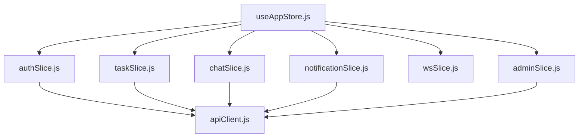
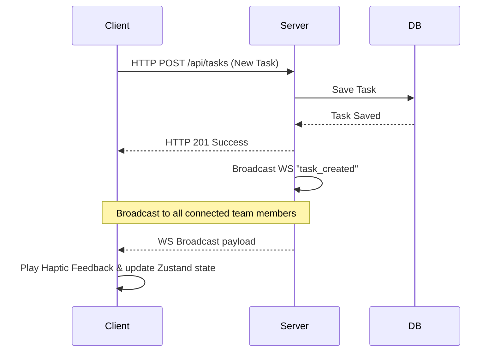

# Mohemmaty - UI/UX & System Design Document

This document outlines the visual design system, frontend architecture, and UX decisions that shape the **Mohemmaty** application.

---

## 1. Visual Design System

Mohemmaty is designed with a premium, modern, and dark-centric aesthetic. It leverages CSS custom properties (variables) to enable a seamless dark/light theme toggle.

### Color Palette (Theming)
We use tailored HSL colors to ensure visual harmony, proper contrast ratios, and comfortable readability in both dark and light modes.

```css
/* Color tokens defined in index.css */
:root {
  --primary: #1e40af;          /* Royal Blue */
  --primary-hover: #1d4ed8;    
  --primary-light: rgba(30, 64, 175, 0.08);
  
  --bg-app: #f1f5f9;           /* Slate Light background */
  --bg-card: #ffffff;          /* White card */
  --text-main: #0f172a;        /* Deep Slate text */
  --text-muted: #475569;       /* Slate muted */
  --border: #cbd5e1;
  
  /* Status Colors */
  --status-todo: #64748b;
  --status-progress: #1e40af;
  --status-review: #6d28d9;
  --status-done: #047857;
}

.dark-theme {
  --bg-app: #0f172a;           /* Deep Navy background */
  --bg-card: #1e293b;          /* Charcoal card */
  --text-main: #f8fafc;        /* Off-white text */
  --text-muted: #94a3b8;       /* Slate gray muted */
  --border: #334155;
  --primary: #3b82f6;          /* Bright Blue for dark mode */
  --primary-hover: #60a5fa;
}
```

### Typography
We use a clean, modern dual-font setup to ensure excellent readability:
- **Arabic Text:** `IBM Plex Sans Arabic` - structured, highly readable Arabic typeface.
- **English/Technical Text:** `Inter` - standard, clean sans-serif for numbers, dates, and English strings.

---

## 2. Component Hierarchy

The frontend follows an atomic-inspired component architecture to keep views highly reusable, maintainable, and clean.

```
client/src/components/
├── atoms/               # Smallest stateless/pure UI units
│   ├── Button.jsx       # Custom styled action buttons
│   ├── Input.jsx        # Text, Password, and Select input wrapper
│   ├── Avatar.jsx       # Rounded profile image with initials fallback
│   └── ErrorBoundary.jsx# React Boundary to catch render failures
│
├── organisms/           # High-level layout components
│   ├── Navbar.jsx       # Dynamic navigation bar with touch gestures
│   ├── NotificationDrawer.jsx # Slide-out notification panel
│   └── ToastContainer.jsx     # Managed container for notifications alerts
│
└── pages/               # Fully assembled router-linked views
    ├── Dashboard.jsx    # Metrics, charts, and quick-add tasks
    ├── TaskManager.jsx  # Task columns, details drawer, comments
    ├── ChatRoom.jsx     # WebSocket group messaging feed
    ├── TeamDirectory.jsx# Member roles list and profile cards
    ├── AdminDashboard.jsx# User and system settings dashboard
    ├── Maintenance.jsx  # Elegant full-screen maintenance message
    └── Login.jsx        # Login & registration forms
```

---

## 3. State Management (Zustand & Slices)

Zustand is used for centralized client-side state. The store is split into specialized slices located in `client/src/store/slices/` and merged inside `useAppStore.js`.



- **authSlice:** Handles authentication state, currentUser details, token persistence in `localStorage`, and login/register actions.
- **taskSlice:** Manages tasks list, loading indicators, comments adding/removing, and CRUD operations.
- **chatSlice:** Holds the active array of chat messages and sends text messages to the backend.
- **notificationSlice:** Stores user notifications, manages the slide-out drawer, and controls toast popups.
- **wsSlice:** Manages active WebSocket connections, listener bindings, and status updates (`connecting`, `connected`, `disconnected`).
- **adminSlice:** Holds the state for the Admin Panel, including member management settings, system settings, and maintenance overrides.

---

## 4. Mobile-First & Phone Mockup Layout

A signature feature of the Mohemmaty design is its **Phone Mockup wrapper** on desktop screens, simulating a mobile device for a realistic PWA feel:
*   **Phone Frame:** A centered `425px` by `850px` container mimicking a smartphone bezel, complete with a top camera notch (`.phone-notch`).
*   **Responsive Adaptation:** On actual mobile screens, the frame vanishes dynamically, stretching to a true full-screen layout.
*   **Safe Areas:** Uses CSS `env(safe-area-inset-top)` variables to prevent content from colliding with iOS status bars or device notches.

### Touch & Swipe Gestures
Navigation tabs can be scrolled or swiped left/right. The `Navbar.jsx` component implements touch event listeners (`touchstart`, `touchend`) to trigger tab transitions when swiping horizontal distances larger than `60px`.

---

## 5. WebSockets & Haptics Flow

To make the app feel alive and responsive, user events trigger real-time updates and physical vibration feedback (on supported devices):



1.  **WebSocket Broadcasts:** When a task is created, updated, or deleted, or when a chat message or comment is added, the server broadcasts a structured event to all active clients. The client listens and updates its Zustand store, prompting immediate, smooth UI updates without page reloads.
2.  **Haptic Feedback:** The helper `client/src/utils/haptics.js` uses the HTML5 `navigator.vibrate` API to deliver tactile feedback:
    *   `light` (10ms vibration) - triggered on tab changes.
    *   `medium` (30ms vibration) - triggered on task updates/submissions.
    *   `success` (double vibration) - triggered on successful operations or going online.
    *   `error` (long vibration) - triggered on failed actions or going offline.

---

## 6. Minimalist UI & Clean Presentation Principles

To maintain a premium, uncluttered native mobile feel, all visual layouts adhere to the following principles:
- **No Over-explanations:** Avoid long sentences, descriptions, or helper texts on the main screens. Use clean visual indicators and status pills instead.
- **Redundancy Reduction:** Remove visual labels from input fields when placeholders clearly describe the input (e.g. Email and Password fields).
- **Symbolic Priority Badges:** Rather than writing text names like `"عالية"` (High), task card priority badges use clean visual markers (`!!!` for high, `!!` for medium, `!` for low).
- **Icon-Driven Controls:** Utilize clean icons (e.g. `<AlertCircle size={14} />`) next to filter controls and action items instead of redundant text headers.
